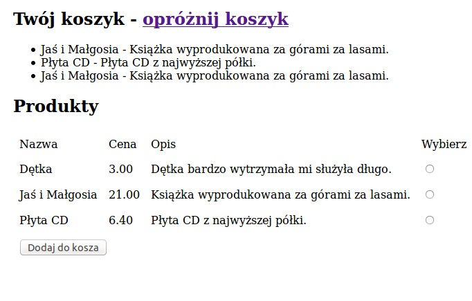

# Sklep

###### Strona wraz z baza danych w spakowanym pliku : sklep_paczka.tar.gz

### Opis

Strona wyświetla koszyk uzytkownika oraz liste produktów z bazy danych.

### Działanie

##### Koszyk

Informacje wraz z lista produktow sa pobierane z sesji ktore nastepnie sa wyswietlane na stronie.

##### Produkty

Lista produktów jest pobierana z bazy danych wraz z formularzem który pozwala na dodanie produktu do koszyka tj. sesji

### Pliki użyte

##### app/config/routing.yml
Odnosniki do podstron sklep,index,wyczysc-sesje
##### app/resources/view/
Widok strony wyswietelnie formularzu wraz z koszem i odnosnikiem
##### src/AppBundle/Controller/
Kontroler w ktorym metody pobieraja dane i przekazuja w postaci tabel do szablonu strony.
##### src/AppBundle/Entity
Tabele w ktorych zostały zamieszczone dane produktow oraz i uzycie.

### Widok

